Ejercicio 1: 

**Detalle del Trabajo Realizado**
Este proyecto implementa un sistema en Java para gestionar precios de casas y departamentos utilizando estructuras de datos dinámicas (ArrayList).
El programa funciona mediante un menú interactivo que permite: 

- Ingresar precios
- Listar todos los precios almacenados
- Mostrar el precio más alto y el más bajo
- Mostrar precios iguales
- Buscar un precio específico dentro de la colección

Se aplicaron conceptos como:
- Uso de ArrayList<Double>
- Validación de datos
- Menú con ciclos repetitivos
- Uso de métodos para modularizar el código
- Manejo de entrada de datos con Scanner
- Modelado UML básico

**Enunciado del Ejercicio**

Desarrollar un programa en Java que permita gestionar los precios de casas y departamentos usando colecciones.

Requerimientos principales: 

Utilizar un ArrayList<Double> para almacenar los precios.

Implementar un menú con las siguientes opciones:
- Opción 1: Ingresa un precio mayor que cero y lo agrega a la lista.

- Opción 2: Muestra todos los precios, o avisa si la lista está vacía.

- Opción 3: Calcula y muestra el precio más alto.

- Opción 4: Calcula y muestra el precio más bajo.

- Opción 5: Permite ingresar un valor y verifica si existen precios iguales.

- Opción 6: Permite buscar un precio utilizando contains().

- Opción 7: Finaliza el programa.

**Capturas del codigo:**

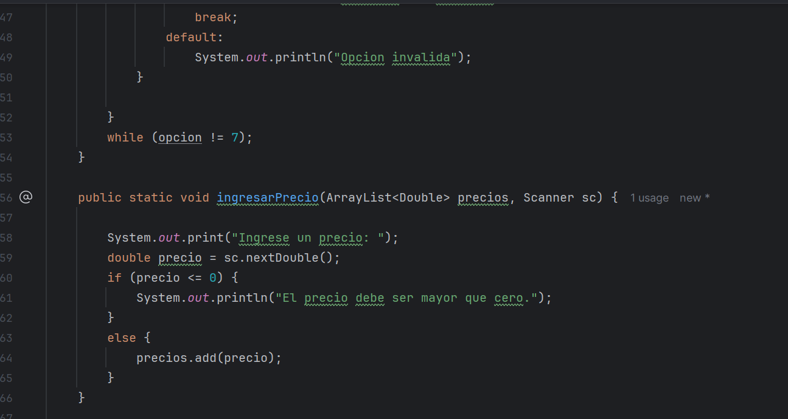

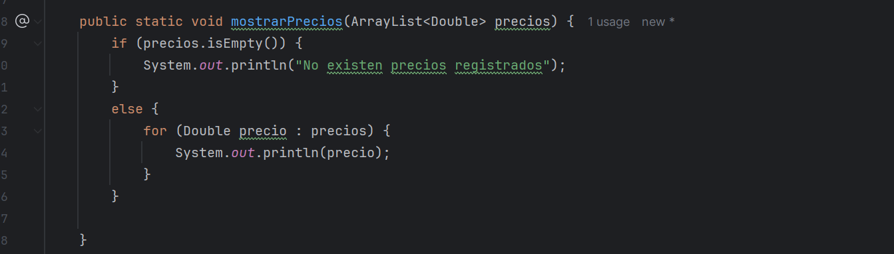

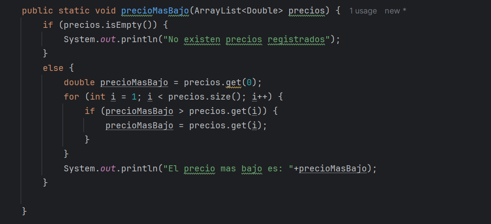

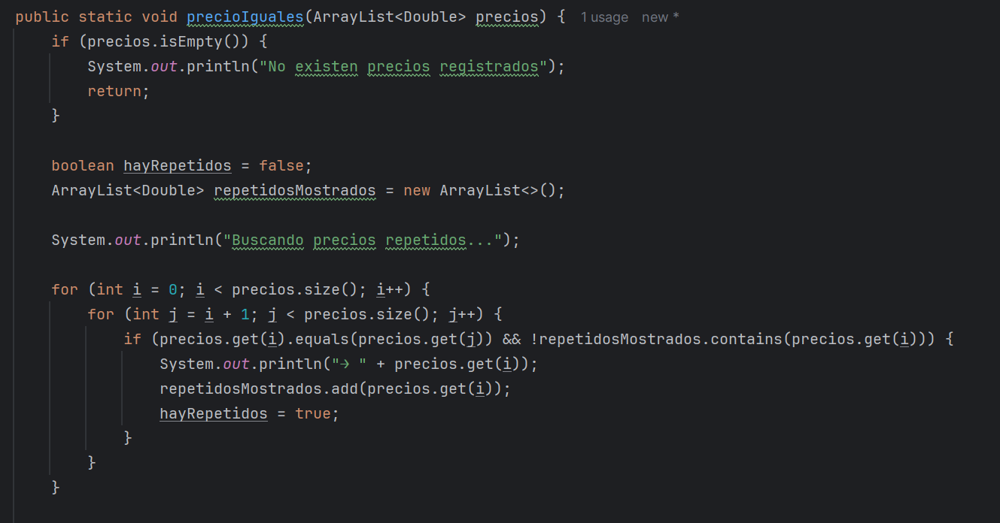

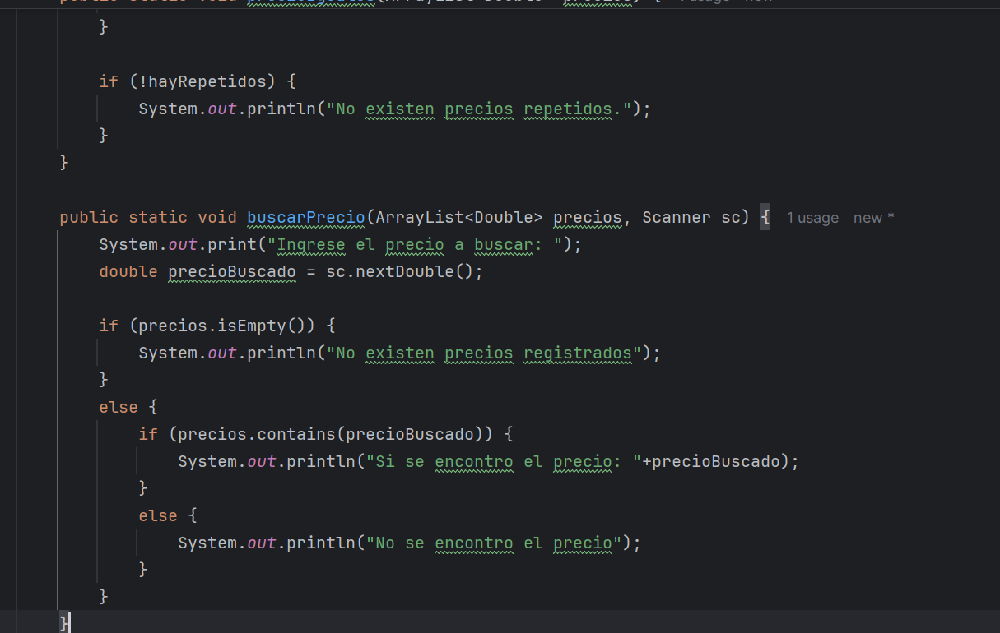

**Capturas del Resultado**

Opcion 1: Ingresar precio

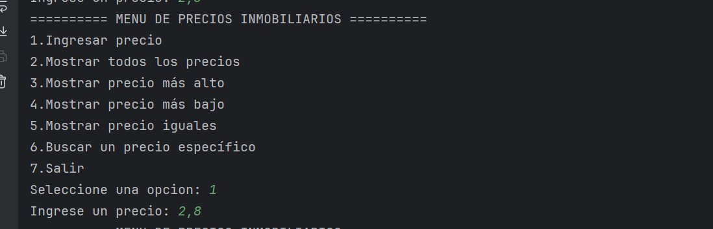

Opcion 2: Mostrar todos los precios

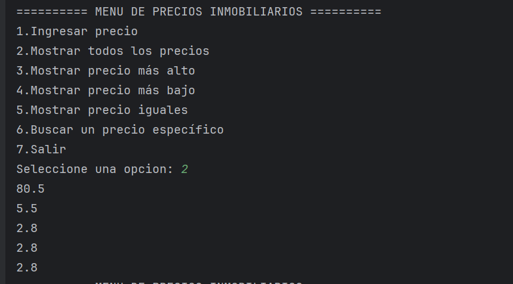

Opcion 3: Mostrar el precio mas alto

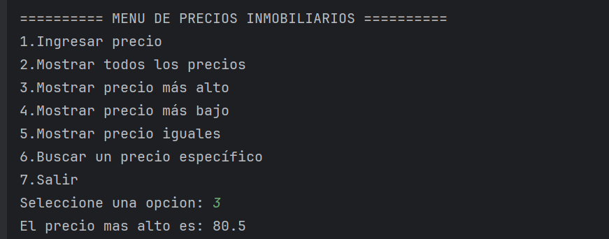

Opcion 4: Mostrar el precio mas bajo

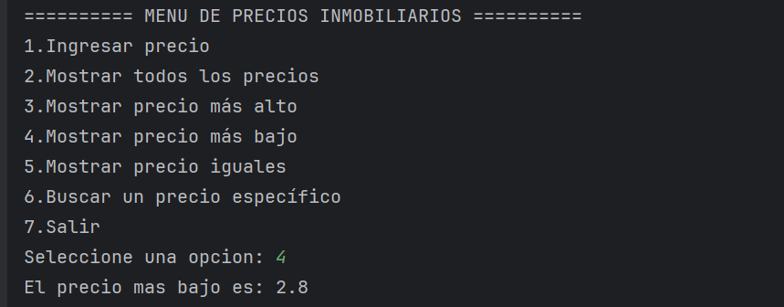

Opcion 5: Mostrar precios iguales

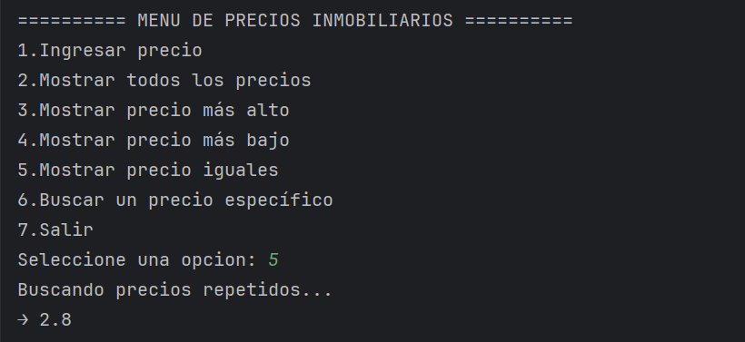

Opcion 6: Buscar precio

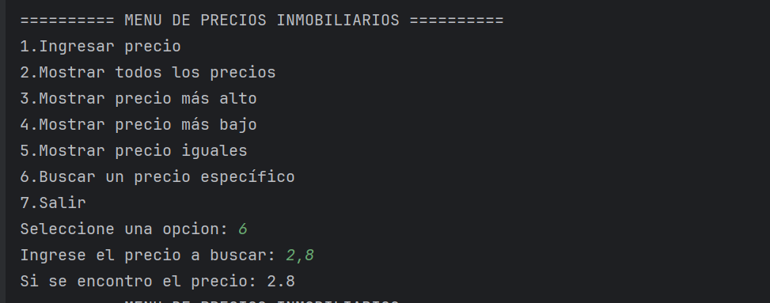

Opcion 7: Salir

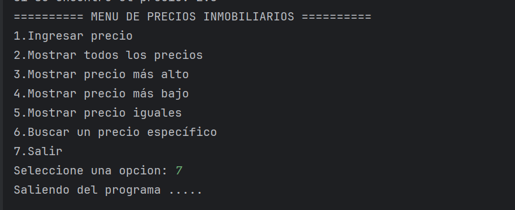

Ejercicio 2: Sistema de registro de Olimpiadas

**Detalle del trabajo:**

En este ejercicio se desarrolló un sistema en Java para gestionar una Olimpiada, aplicando los conceptos principales de Programación Orientada a Objetos.

✔ Implementación realizada

- Clase abstracta Participante: contiene atributos base y un método abstracto mostrarTipo().

- Clases hijas Atleta y Equipo: heredan de Participante y sobrescriben el método abstracto para aplicar polimorfismo.

- Clase Evento: permite registrar participantes utilizando un ArrayList.

- Clase Olimpiada: almacena la información general y la lista de eventos registrados.

- Excepciones personalizadas: usadas para validar datos incorrectos (edad, número de integrantes, dorsal, cadenas vacías).

- Uso de ArrayList: para manejar listas dinámicas en participantes y eventos.

- Menú principal: permite registrar la olimpiada, crear eventos, agregar participantes y consultar información.

**Enunciado del trabajo:**

Desarrollar un sistema básico orientado a objetos para gestionar Olimpiadas, Eventos deportivos y Deportistas, aplicando:
Clases e instancias , Herencia , Composición , Uso de ArrayList , Manejo de excepciones (según requerimientos del trabajo) ,Representación UML.

El sistema debe permitir registrar deportistas, crear eventos, asignar deportistas a eventos y relacionar eventos dentro de una Olimpiada.

**Justificaciones Técnicas:**

¿Por qué se usa herencia?

Para reutilizar código, evitar duplicar atributos y modelar correctamente relaciones del mundo real (por ejemplo, si hubiera Deportista → Nadador, Corredor, etc.).

¿Por qué se usa composición?

Porque una Olimpiada contiene Eventos y un Evento contiene Deportistas.
Si la Olimpiada desaparece, sus eventos también; eso corresponde a composición en UML.

¿Por qué usar ArrayList en lugar de arreglos comunes?

Permite crecimiento dinámico, métodos útiles: add(), remove(), size() , se integra mejor con colecciones de Java y es más flexible para CRUD.

**Capturas del Código:**

Clase Abstracta: Participante

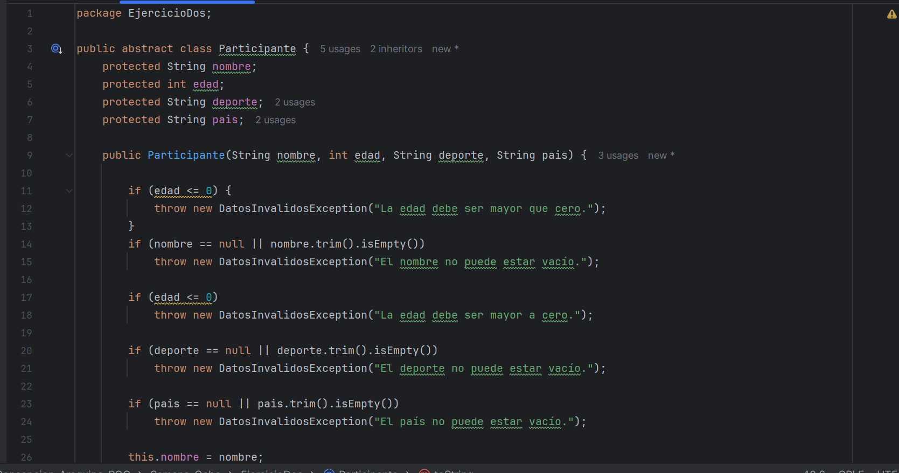

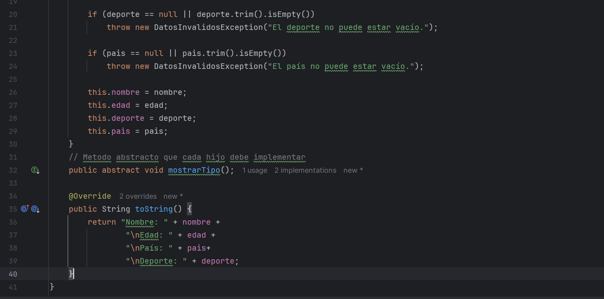

Subclase: Atleta
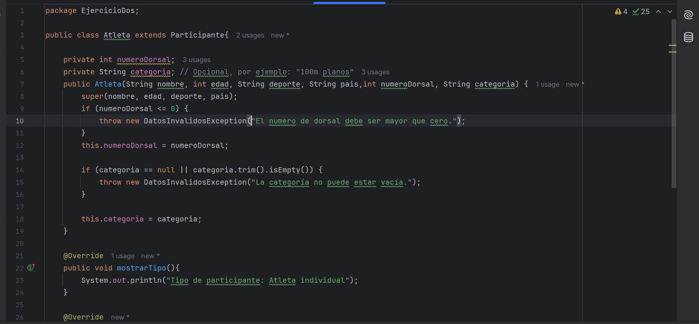

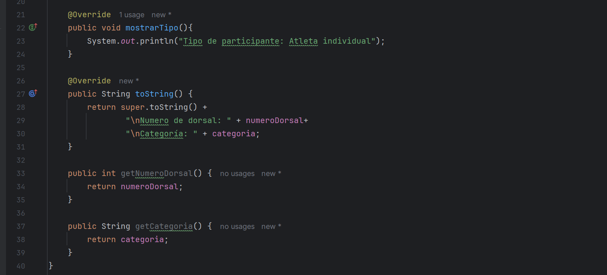

Subclase: Equipo

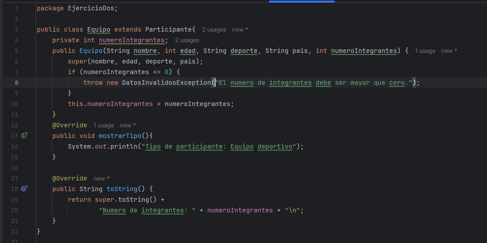

**Resultados del programa:**

Opcion 1: Crear evento

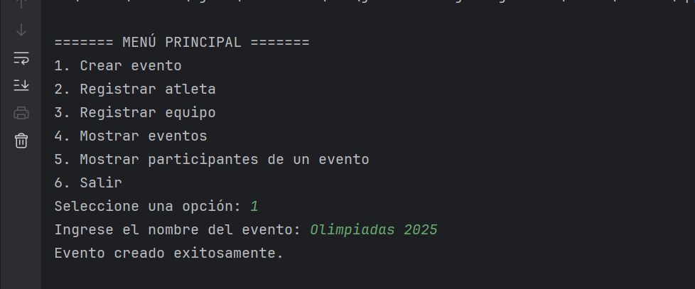

Opcion 2: Registrar Atleta

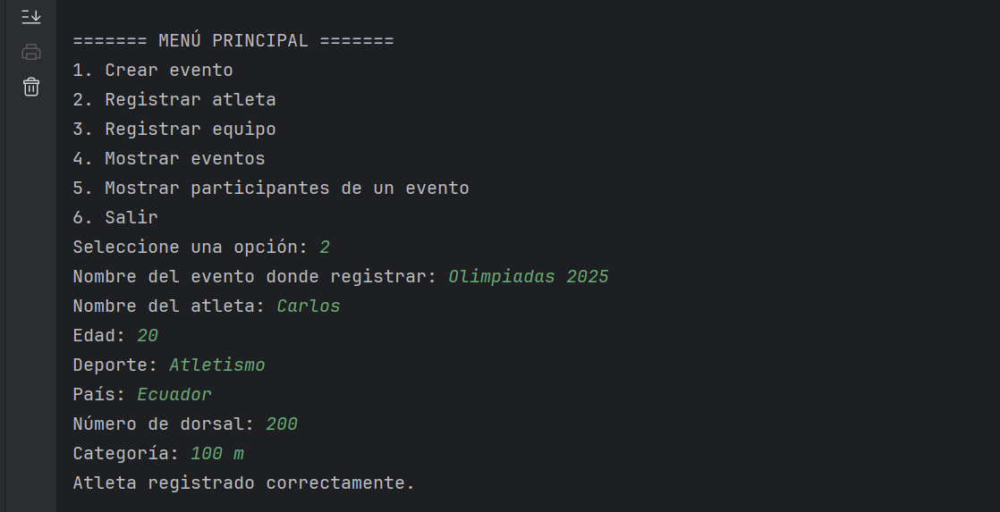

Opcion 3: Registrar equipo

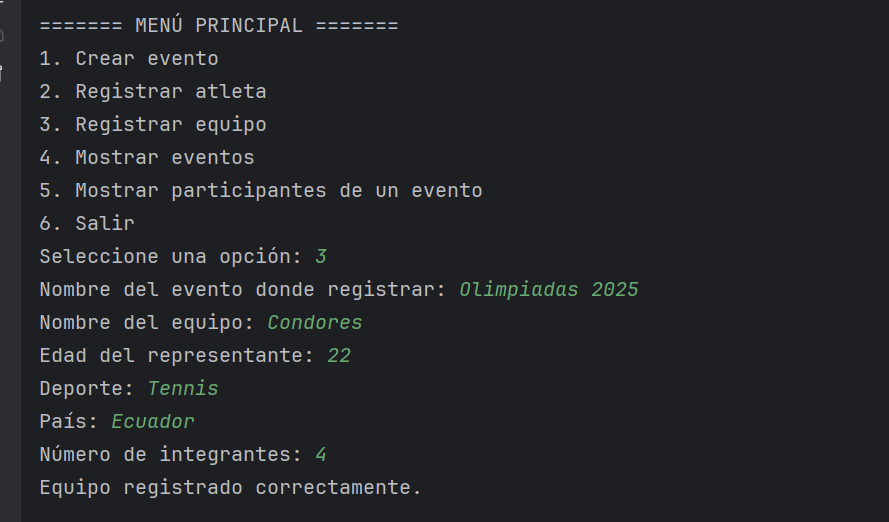

Opcion 4: Mostrar eventos

Opcion 5: Mostrar participantes

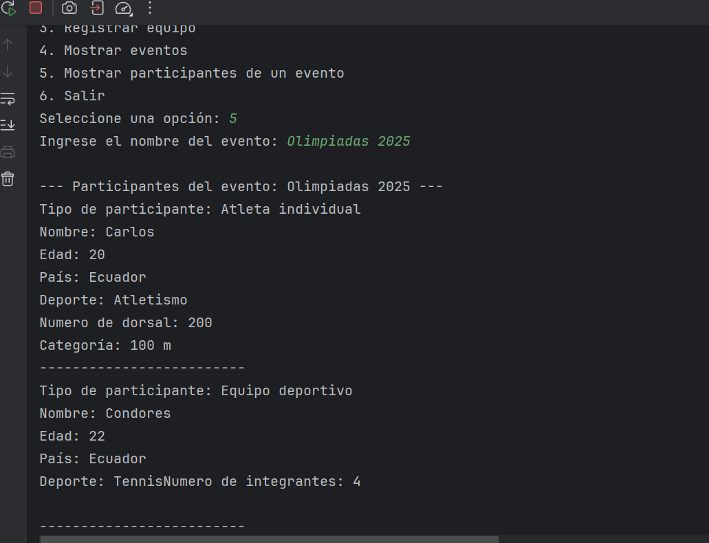

Opcion 6: Salir

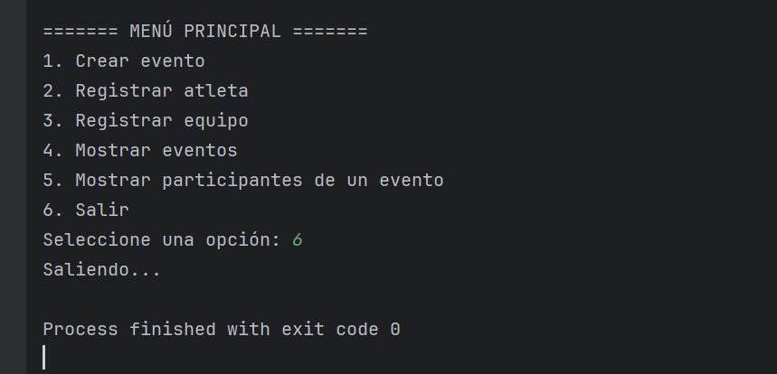